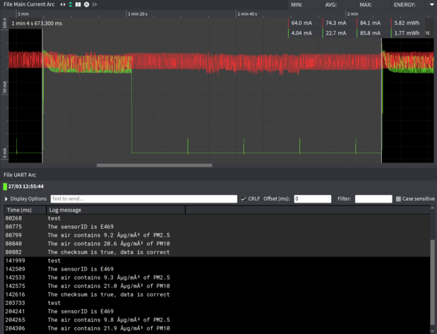
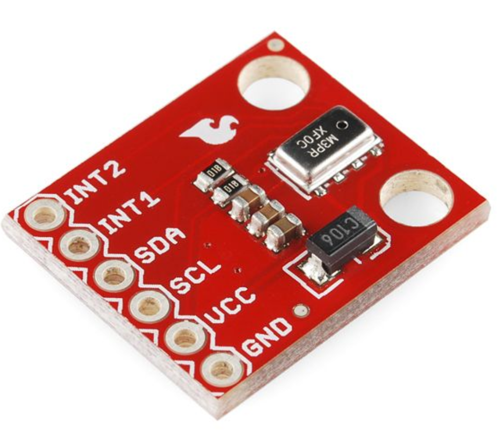

# Particula powerconsumtion
This is a repository where we put information about how much energy every sensor uses.

## Particle sensor

### Powerconsumption SDS011

|Technical Parameters   |   |Practical   |   |
|---|---|---|---|
|Rated voltage:   |5V   |Rated voltage:   |5V   |   |
|Rated Current:   |70mA±10mA  |Rated Current:   |91,5mA   |   |
|Sleep Current:   |<4 mA   |Sleep Current:   |5,07mA   |   |

### Practical

measurement setup:

### measure results

1 cycle takes 1 minute. In the red graph the sensor don't use the funtion sleepmode. In the green graph the sensor uses the function sleepmode. The sensor is 15s in working and 45s in sleepmode.

We see that the red graph consumes a power of 5,8 mWh.
The green graph consumes a power of 1,77 mWh. this is 70% less.

## TPH senor

### Values datasheet

### Practical

AVG current ≈ 438µA

## Total AVG current

70mA+483µA = 70,483mA

