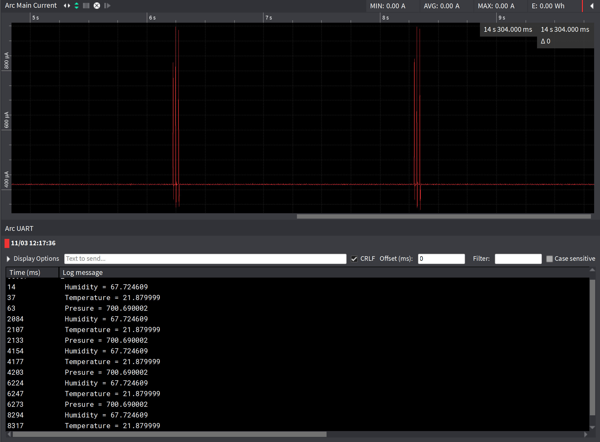

# Particula powerconsumtion
This is a repository where we put information about how much energy every sensor uses.

## Particle sensor

### Powerconsumption SDS011

|Technical Parameters   |   |Practical   |   |
|---|---|---|---|
|Rated voltage:   |5V   |Rated voltage:   |5V   |   |
|Rated Current:   |70mA±10mA  |Rated Current:   |91,5mA   |   |
|Sleep Current:   |<4 mA   |Sleep Current:   |5,01mA   |   |

### Practical

Meetopstelling:

### measure results

## TPH senor

### Values datasheet

### Practical

AVG current ≈ 438µA

## Total AVG current

70mA+483µA = 70,483mA

