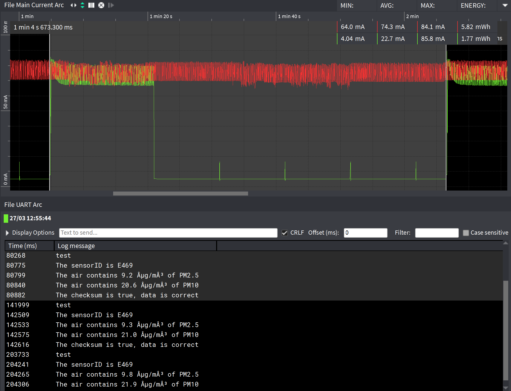

# Particula powerconsumtion
The Particula project is about a Smart Self-Sufficient Open Wireless Air Quality Sensor. This IoT device makes use of a particle sensor, a tph sensor (temperature, pressure, humidity) and LoRaWAN to transmit the data.

Of course this setup needs some power. Thats why we have a self-charging battery system with solar panels in place. But what if theres no sun for example, 2 weeks?

Thats why we have to calculate exactly how much each measure-cycle consumes and add "sleep" times between these cycles so we can cover these 2 weeks.

But how long should these sleep times take?

## Particle sensor

### Powerconsumption SDS011

|Technical Parameters   |   |Practical   |   |
|---|---|---|---|
|Rated voltage:   |5V   |Rated voltage:   |5V   |   |
|Rated Current:   |70mA±10mA  |Rated Current:   |91,5mA   |   |
|Sleep Current:   |<4 mA   |Sleep Current:   |5,07mA   |   |

### Practical

measurement setup:

### measure results

1 cycle takes 1 minute. In the red graph the sensor don't use the funtion sleepmode. In the green graph the sensor uses the function sleepmode. The sensor is 15s in working and 45s in sleepmode.

We see that the red graph consumes a power of 5,8 mWh.
The green graph consumes a power of 1,77 mWh. this is 70% less.

|   |1 hour   |1 day   |1 Week   |2 weeks   |
|---|---|---|---|---|
|Without sleepmode   |348mWh|8352mWh|58464mWh|116,9Wh|
|with sleepmode   |106mWh|2548,8mWh|17841mWh|35,7Wh|

## TPH senor

### Powerconsumption BME280

|Technical Parameters   |   |Practical   |   |
|---|---|---|---|
|Rated voltage:   |3V   |Rated voltage:   |3V   |
|I during  temperature measurement   |350µA |I during temperature   |440µA   |
|I during pressure measurement   |714µA |I during pressure measurement   |427µA   |
|I during humidity measurement   |340µA |I during humidity measurement   |671µA   |
|Standby current:   |0,1-0,5µA |Standby current:   |419µA (strange!!)   |
|Sleep Current:   |0,1µA  |Sleep Current:   |?  |

### measure results

We see that one cycle of the sensor 1,10µWh uses.
The program that now runs on the nucleo is the normal mode function. 

## Calulations

The following values you can find in the Enery_Budget_Particla.xlsx file.

These are the values we measured in one cycle not accounting sleepmode times, because the idea is we will change the sleepmode times depending on how long the battery(s) last.

This took quite a while because not every subprocess takes the same amount of time.

Good thing about the sleepmode, it isn't very hard to measure because the sleepmodes take the same amount of time.

We did ran into a problem though, these are the power usages of each sleep mode but when measuring we saw a total of 27mA instead of 5,7mA. We assume the extra 21mA is from the flash and LED on the board that won't be on our end project.

Thats why in the next calculations we will disregard the 21mA.

Here we present 7 scenarios of how long the cycles (active +  sleep) take. Only the sleep times are variable.

We can see with one battery we can last about 2 weeks if the cycle (active+sleep) takes 60 minutes.

Of course of we add another battery, doubeling the budget we can see that with 2 batterys we can last about 2 weeks with a cycle time of 32 minutes!

So the choice is up to the people who decide how many batterys to use, only got 1 battery? Make the sleep time in each cycle 3565.80s if you want to last 2 weeks. Got 2 batterys?  Make the sleep time in each cycle 1765.80s

