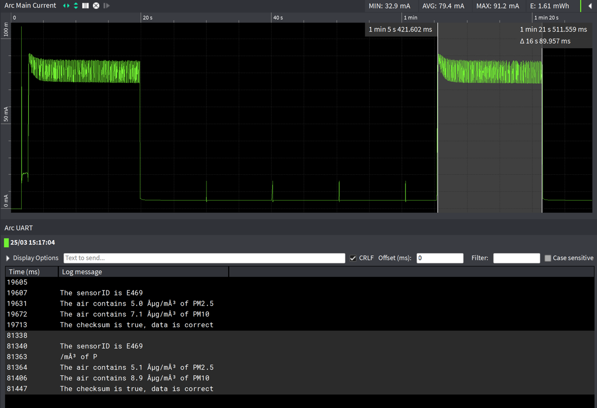

# Particula powerconsumtion
This is a repository where we put information about how much energy every sensor uses.

## Particle sensor

### Values datasheet

In de datasheet vinden we terug dat de nominale stroom maximaal 70mA mag zijn. In sleepmode verbruikt de sensor minder dan 4mA.

### Practical

Meetopstelling:

#### Gemiddelde stroomverbruik zonder sleepmode

AVG current ≈ 70mA

#### Gemiddelde stroomverbruik met sleepmode

AVG current ≈ 5mA

AVG current ≈ 80mA

## TPH senor

### Values datasheet

### Practical

AVG current ≈ 438µA

## Total AVG current

70mA+483µA = 70,483mA

